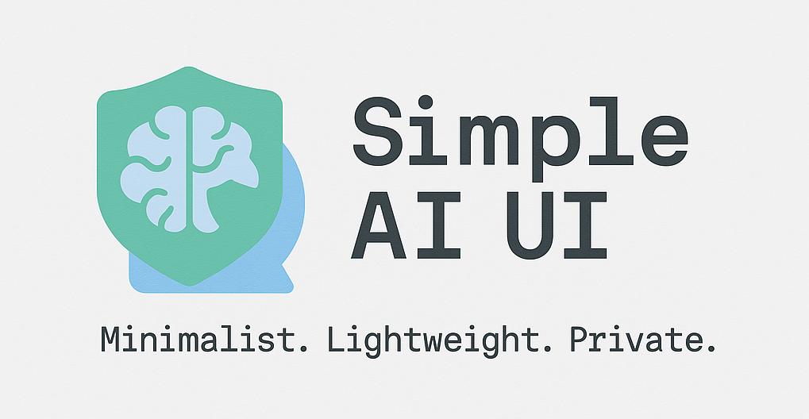

# Simple AI UI

Simple AI UI is a minimalist and lightweight web GUI that allows you to host your own AI on your local network or the internet.

---

## Table of Contents

1. [Features](#features)
2. [Supported Platforms](#supported-platforms)
3. [Flavors](#flavors)
4. [APIs](#apis)
5. [Server Configuration](#server-configuration)
6. [Installation](#installation)
7. [Credits](#credits)
8. [License](#license)

---

## Features

- Robust API infrastructure
- Simple, minimalist, and lightweight UI
- Privacy: Your data is stored on your computer
- Chat History - [COMING SOON]
- Memory for AI - [COMING SOON]
- Admin Panel - [COMING SOON]
- More APIs - [COMING SOON]

---

## Supported Platforms

- Windows
- Mac
- Linux

**NOTE:** Ollama must be installed on the system.

---

## Flavors

- **Python** - Code Name: Simple-AI-UI-EASY
- **Rust-lang** - Code Name: Simple-AI-UI-ThunderBOLT [COMING SOON]

---

## APIs

For detailed documentation, refer to `./docs/apis.md`.

---

## Server Configuration

For detailed documentation, refer to `./docs/server-config.md`.

---

## Installation

### For Python Lovers and Enthusiasts:

1. **Clone the repository:**
   ```bash
   git clone https://github.com/junaidcodingmaster/SIMPLE-AI-UI
   cd SIMPLE-AI-UI
   ```

2. **Create a virtual environment:**
   ```bash
   python3 -m venv venv
   ```

3. **Activate the virtual environment:**

   **Windows:**
   ```bash
   .\venv\Scripts\activate
   ```

   **Linux or Mac:**
   ```bash
   source ./venv/bin/activate
   ```

4. **Install requirements:**
   ```bash
   pip install -r ./requirements.txt
   ```

5. **Run the application:**
   ```bash
   python app.py
   ```

### For Windows EXE - Coming Soon

### For Linux Binaries - Coming Soon

---

## Credits
Made By [Junaid](https://abujuni.dev)

---

## License

This project is licensed under the MIT License. See the `LICENSE` file for more details.